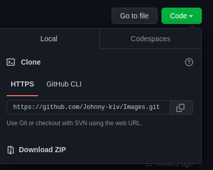

<h1>Images</h1> 
<h2>Content</h2>

_______________________________________________________
<h2>Filter Instructions</h2>
<h3>Install</h3>
<h4>Download this project in ZIP Code/Download ZIP.</h4>



<p>Unpack project.</p>

<p>If you have not installed Pycharm <a href="https://www.jetbrains.com/pycharm/">follow the link</a> and install it.</p>
<p>Open this project in Pycharm</p>
<p>Open terminal and install 2 modules with commands:<p>
<p>* pip install numpy</p>
<p>* pip install Pillow</p>

_______________________________________________________
<h3>Run</h3>
<p>Find filter/filter.py and run. You will get this picture:</p>


```
        g = int(p[1])
        b = int(p[2])
```

<p>You make image without green and blue color.</p>